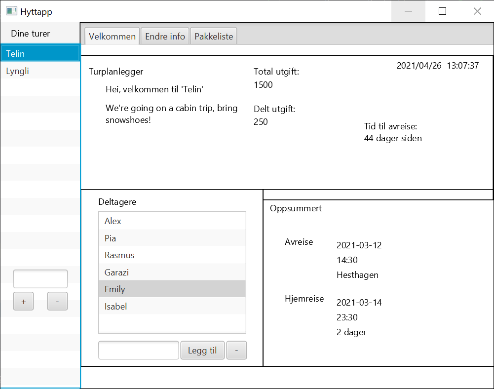

# Hyttapp

Hyttapp is a planning application for cabin and hiking trips.
This app is made for the course TDT-4100 - Object-Oriented Programming at NTNU.



## How to use:
First run `mvn install` to install the necessary dependencies.

To open the app:
```bash
mvn javafx:run
```
To run tests:
```bash
mvn test
```

# Documentation
Additional documentation can be found in the [documentation](Documentation) folder.

# Contributors
- Pia Asbjørnsen
- Alexander Høyby
